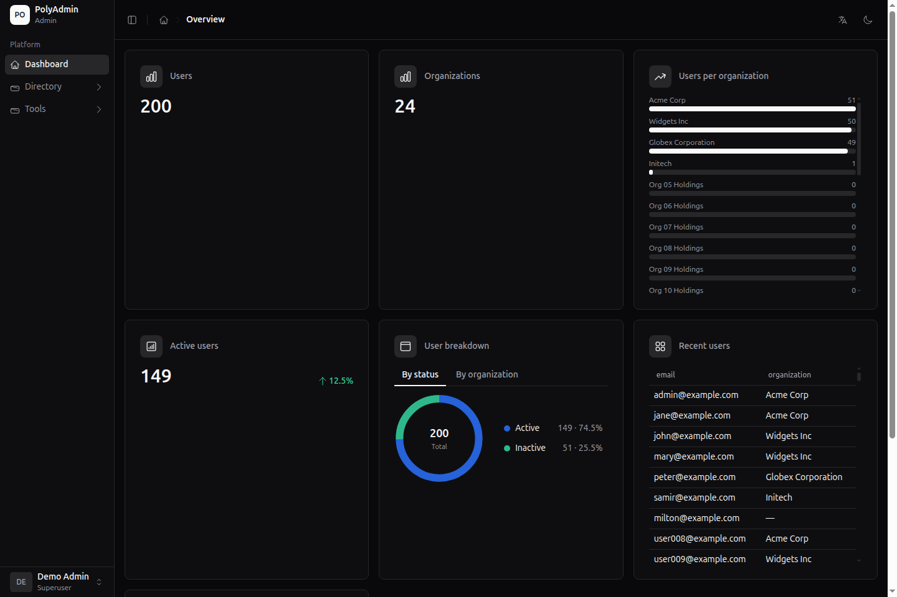
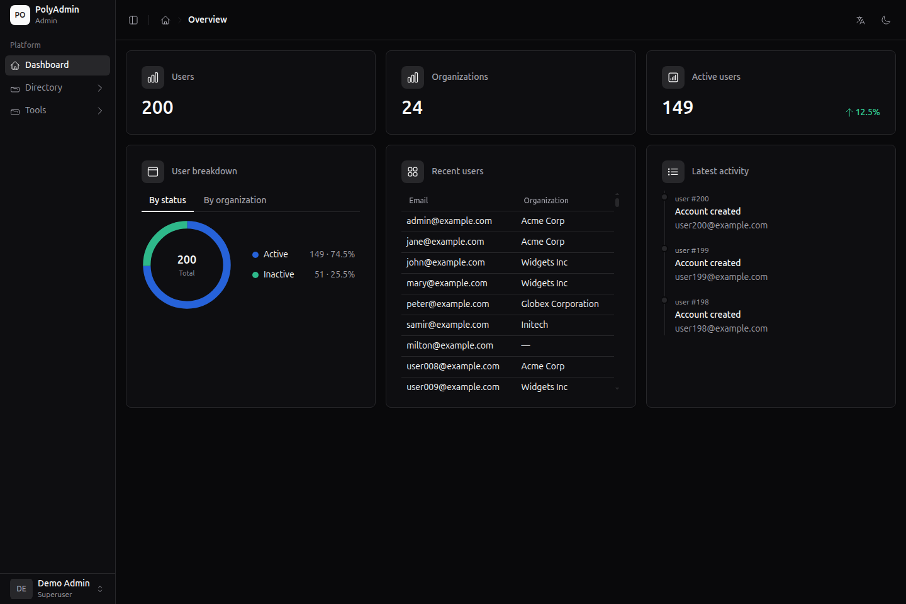

# PolyAdmin

## Operations tools that belong in your application

PolyAdmin turns your existing Python or Go application into a focused,
server-rendered operations workspace. Declare the resources your team needs
to manage and get lists, forms, permissions, dashboards, and workflows
without building an admin surface from scratch.

[Start with Python](python/index.md){ .md-button .md-button--primary }
[Start with Go](go/index.md){ .md-button }
[Explore the architecture](concepts/architecture.md){ .md-button }

## Built around your application

PolyAdmin owns the admin experience. Your application keeps ownership of the
things that matter: models, storage, business rules, and authentication.

```text
Your application
  models + ORM plugins + business rules + authentication
                |
                v
           PolyAdmin
  resources + forms + lists + permissions + workflows
                |
                v
       Web framework adapter
       current: FastAPI or Fiber
```

The core is intentionally independent of a specific ORM or web framework.
Python and Go are the implementation layers; adapters and ORM plugins can
grow around them as the ecosystem expands.

## Choose your implementation

=== "Python"

    Use the Python implementation with the web framework and ORM of your
    choice. The current adapter uses FastAPI, with Jinja templates and
    asynchronous lifecycle hooks supported by the Python API.

    [Python getting started guide](python/index.md){ .md-button .md-button--primary }

=== "Go"

    Use the Go implementation with the web framework and ORM of your choice.
    The current adapter uses Fiber and the standard `html/template` renderer.

    [Go getting started guide](go/index.md){ .md-button .md-button--primary }

## Quickstart

The reference applications are the fastest way to see the complete
experience locally. They use in-memory repositories, so you can explore the
interface without configuring a database first.

=== "Python"

    ```bash
    git clone https://github.com/MagicRodri/polyadmin.git
    cd polyadmin/examples/fastapi
    uv sync
    uv run uvicorn main:app --reload
    ```

    Open [http://127.0.0.1:8000/admin](http://127.0.0.1:8000/admin) and sign
    in with `admin@example.com` / `polyadmin`.

    The [FastAPI example README](https://github.com/MagicRodri/polyadmin/tree/main/examples/fastapi)
    explains the viewer account, session secret, and test suite.

=== "Go"

    ```bash
    git clone https://github.com/MagicRodri/go-polyadmin.git
    cd go-polyadmin/examples/fiber
    go run .
    ```

    Open [http://127.0.0.1:3000/admin](http://127.0.0.1:3000/admin) and sign
    in with `admin@example.com` / `polyadmin`.

    The [Fiber example README](https://github.com/MagicRodri/go-polyadmin/tree/main/examples/fiber)
    explains the viewer account, session secret, and test suite.

## What you get

| Resource management | Operations experience | Integration surface |
| --- | --- | --- |
| CRUD for any storage layer | Search, filters, sorting, and pagination | Web framework adapters |
| Relations and inline records | Dashboard widgets and custom pages | ORM-independent lifecycle hooks |
| Record and bulk actions | Delete previews and flash notifications | Authentication and authorization hooks |
| CSV and XLSX exports | Dark mode, theming, and internationalization | Per-resource and per-widget templates |

Updates are server-rendered and enhanced with HTMX, so the default setup
needs no frontend build step.

## See it in action

The reference applications exercise the complete workflow rather than a
toy CRUD screen. They include users, organizations, roles, relations,
filters, dashboards, actions, custom pages, authentication, and exports.

- [FastAPI reference application](https://github.com/MagicRodri/polyadmin/tree/main/examples/fastapi)
- [Fiber reference application](https://github.com/MagicRodri/go-polyadmin/tree/main/examples/fiber)

=== "Python dashboard"

    

    The Python implementation combines metrics, charts, breakdowns, tables,
    and activity into one server-rendered overview.

=== "Go dashboard"

    

    The Go implementation presents the same operations model through its
    Fiber adapter and Go templates.

## Find your next step

- **New to PolyAdmin:** start with [Python](python/index.md) or [Go](go/index.md).
- **Designing an integration:** read [Architecture](concepts/architecture.md)
  and [Model administration](concepts/model-admin.md).
- **Shaping the interface:** see [Frontend and theming](concepts/frontend.md)
  and the language-specific template guides.
- **Preparing for production:** review [Authentication](authentication.md),
  [Permissions](permissions.md), and [Routing](routing.md).